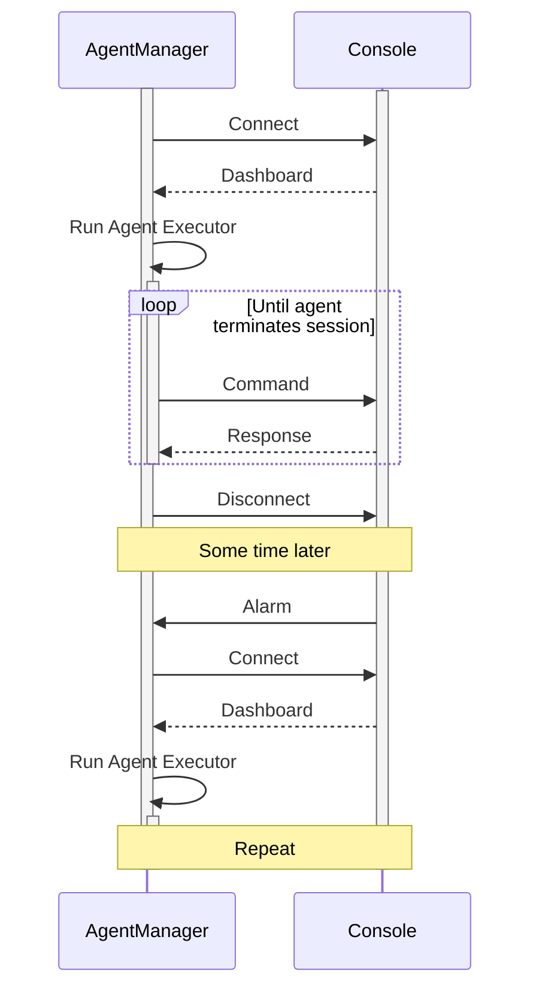

# Communication Between AgentManager and Console

```mermaid
sequenceDiagram
    participant AgentManager
    participant Console

    activate AgentManager
    activate Console

    AgentManager->>Console: Connect
    Console-->>AgentManager:Dashboard
    AgentManager->>AgentManager:Run Agent Executor
    activate AgentManager
    
    loop Until agent terminates session
        AgentManager->>Console:Command
        Console-->>AgentManager:Response
    end

    deactivate AgentManager
    AgentManager->>Console:Disconnect


    Note over AgentManager,Console: Some time later
    Console->>AgentManager:Alarm
    AgentManager->>Console: Connect
    Console-->>AgentManager:Dashboard
    AgentManager->>AgentManager:Run Agent Executor
    activate AgentManager

    Note over AgentManager,Console: Repeat

    deactivate AgentManager
    deactivate AgentManager


    deactivate Console

```