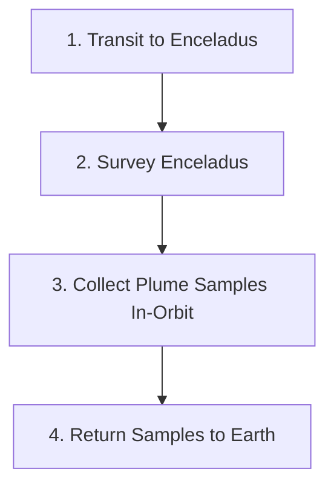

# Dreamcatcher Mission Functional Flow Block Diagram

```mermaid
graph TB
    A[1. Transit to Enceladus] --> B[2. Survey Enceladus]
    B --> C[3. Collect Plume Samples In-Orbit]
    C --> D[4. Return Samples to Earth]
```